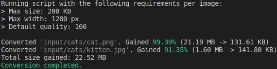

# Webpy


This Python script optimizes images by converting them to WebP and resizing them to reduce file size and dimensions.
It is particularly useful for optimizing images for web usage, enhancing site performance, and improving SEO by reducing page load times.



## Features

- Converts images to the WebP format for better compression and smaller file sizes.
- Resizes images to specified maximum dimensions to ensure optimal display on web pages.
- Iteratively adjusts image quality to meet target file size and dimension constraints.
- Supports processing of various image formats including PNG, JPG, JPEG and WebP.
- Preserves folder structure of input directory in the output directory.

## Installation

1. Clone the repository
2. Navigate to the project directory  
3. Install Pillow with pip:

> If 'python3' is not working for you, try with 'python'

```bash
python3 -m pip install --upgrade pip  
python3 -m pip install --upgrade Pillow
```

## Usage

1. Place your images files or folders in the `input` directory.  
2. Run the script: `python3 script.py`
3. You can check the optimization percentage in real-time in the logs.  
4. Check the `output` directory for the optimized images.

## Configuration  

You can customize the optimization parameters such as:

- maximum file size (`max_size_kb`)
- maximum width (`max_width`)
- maximum iterations (`max_iterations`)

## Requirements

- Python 3.6 or above

## Contributing

Contributions are welcome! Here are a few ways you can contribute:

- Report bugs or issues
- Suggest new features or enhancements  
- Submit pull requests

## License

This project is licensed under the [MIT License](LICENSE).
